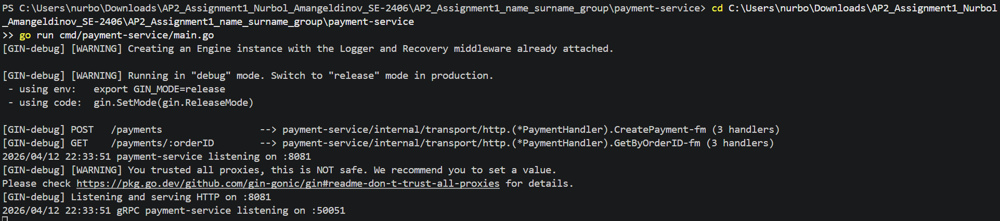
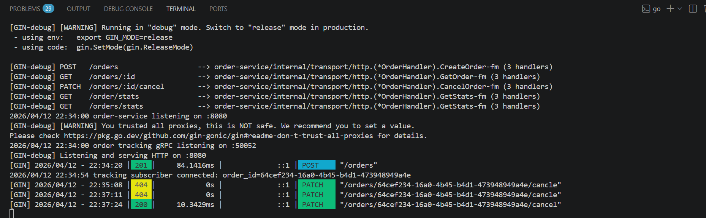
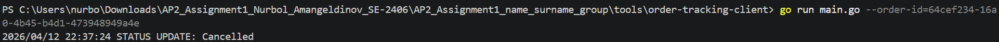

# Assignment 2 – Microservices with gRPC

## Services

- order-service (REST API + gRPC streaming)
- payment-service (gRPC server)
- generated-contracts (proto compiled code)

---

## Architecture

Order Service → Payment Service (Unary gRPC)  
Order Tracking → Streaming gRPC (Server-side streaming)

---

## Ports

- Order Service HTTP: 8080
- Payment Service HTTP: 8081
- Payment gRPC: 50051
- Order Tracking gRPC: 50052

---

## Run

### 1. Payment Service
cd payment-service
go run cmd/payment-service/main.go

### 2. Order Service
cd order-service
go run cmd/order-service/main.go

### 3. Tracking Client
cd tools/order-tracking-client
go run main.go --order-id=ORDER_ID

---

## Test

### Create Order
POST http://localhost:8080/orders

### Cancel Order
PATCH http://localhost:8080/orders/{id}/cancel

### Expected Result
Tracking client receives:

STATUS UPDATE: Cancelled

---

## Demonstration

### 1. Run services

#### Terminal 1 – Payment Service
```bash
cd AP2_Assignment1_name_surname_group
cd payment-service
go run cmd/payment-service/main.go




---

Terminal 2 – Order Service
cd AP2_Assignment1_name_surname_group
cd order-service
go run cmd/order-service/main.go

Expected log:


order tracking gRPC listening on :50052

---

Terminal 3 – Tracking Client
cd tools/order-tracking-client
go run main.go --order-id=YOUR_ORDER_ID



---

## Features

- REST API
- gRPC unary (order → payment)
- gRPC streaming (order tracking)
- Idempotency (optional)
- Environment configuration